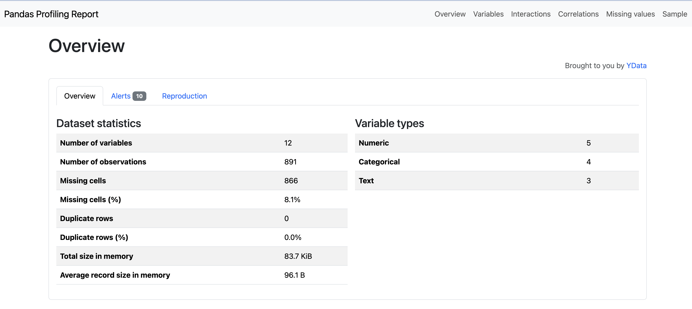
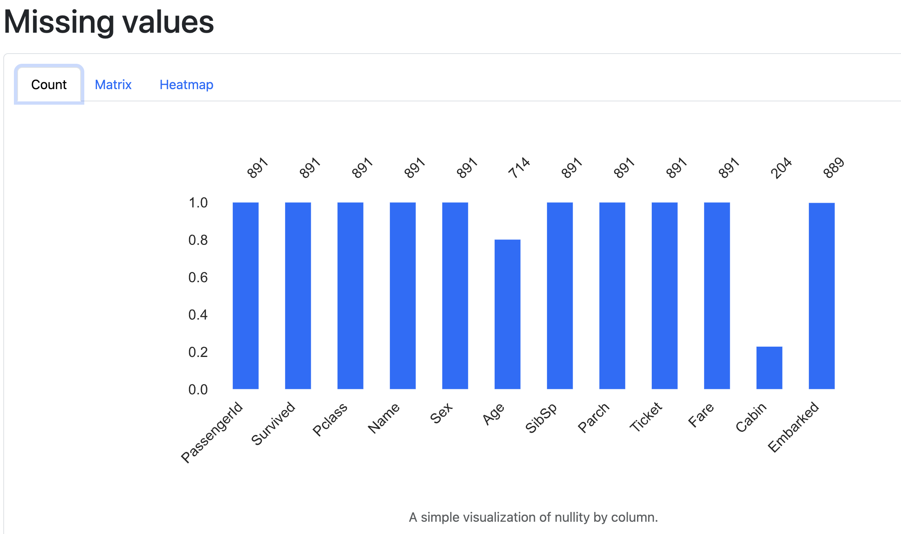

# Pandas Profiling

Pandas Profiling is an amazing tool that automates Exploratory Data Analysis (EDA) by generating a detailed profile report of a dataset. It provides a quick and comprehensive understanding of your data, including statistical summaries, visualizations, correlations, and more—saving you hours of manual data inspection.

## Key Features

- **Overview** of the dataset with details like missing values, duplicates, and memory usage.
- **Variable analysis** for each column (data types, unique values, frequent values).
- **Missing values analysis** with a heatmap and patterns.
- **Correlations** analysis using Pearson, Spearman, and Kendall methods for numerical columns.
- **Interactions** with scatter plots for feature interactions.
- **Sample data** preview to give you a sense of the dataset.

## Installation

To install the latest version of **Pandas Profiling**, use the following command:

```bash
pip install ydata-profiling
```
## Example Visualizations


### 1. Dataset Summary Image:
This image could show the summary section of the Pandas Profiling report, highlighting the dataset's basic stats such as the number of missing values, data types, and other summary metrics.



### 2. Correlations Heatmap:
Show an image of the correlations heatmap generated by Pandas Profiling to visually represent relationships between features.


 ### 3. Missing Values Analysis:
 This image represents the missing values analysis, showing which columns have missing data and visualizing missingness patterns across the dataset.
 
