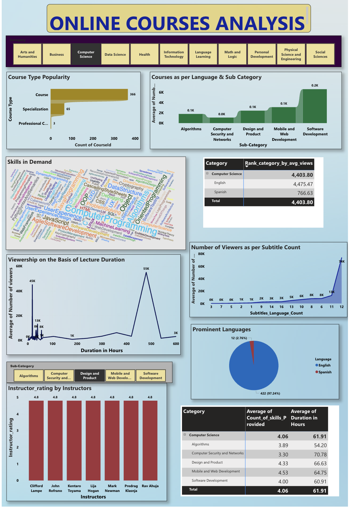

# 🚀 Power BI Dashboard - Tech Startup Online Courses Analysis

## 📊 Overview

In this project, I developed a **Power BI dashboard** to analyze online course data from **an EdTech startup**. The startup aims to expand its **recorded lecture offerings** and has collected data from multiple platforms. My task was to **clean, transform, and analyze this data**, uncovering insights that would help **optimize course content, improve accessibility, and enhance business strategies**.

This dashboard provides **category-wise analysis** of course distribution, instructor performance, language preferences, and viewer engagement. The insights derived from this project are **essential for data-driven decision-making**, enabling the startup to align its offerings with market demands.

🔗 **Live Dashboard Link**: [Click Here to View](https://app.powerbi.com/view?r=eyJrIjoiZjI1YjE0MDgtNTBlYi00OTRlLWI4Y2EtOGIwYjBiMjlkM2Y5IiwidCI6ImQ5Yjc5MGQwLWQyZGQtNGRmMi1iM2M3LTM3OGIxMjUxNzdlYiIsImMiOjN9)

---

## 🏆 Case Study & Problem Statement

**Scenario:**  
I was assigned the role of a **data analyst** working with an **EdTech startup** that collects data from multiple platforms. However, the **raw data was unstructured and difficult to analyze**. My task was to **clean, transform, and analyze the data to extract meaningful insights**.

**Key Business Questions to Address:**
1. **Course Distribution by Category & Subcategory** 📚  
   - Identify **which categories have the highest number of courses**.
   - Determine **which course types are most common in each category**.
   - Help the company **decide which course types to launch** in each category.

2. **Viewer Engagement Analysis** 📈  
   - Calculate the **average number of views per category, subcategory, and language**.
   - Identify **trends in course popularity**.
   - Help the company focus on **high-engagement categories**.

3. **Most Commonly Taught Skills** 🎯  
   - Identify **which skills are being taught most frequently** in each category.
   - Ensure that course offerings **align with job market demands**.

4. **Language Distribution & Preferences** 🌍  
   - Analyze **in which languages the courses are available**.
   - Determine **language preferences for each category based on user engagement**.
   - Provide insights for **content localization and accessibility improvements**.

5. **Impact of Subtitles on Viewer Engagement** 📝  
   - Investigate whether **subtitle availability affects viewer retention**.
   - Help clients **optimize subtitle offerings** for maximum engagement.

6. **Top-Rated Instructors by Category & Subcategory** 🏅  
   - Identify **top 3 instructors per category** based on ratings.
   - Highlight **high-performing educators** who can be approached for new content creation.

7. **Course Duration vs. Viewership Analysis** ⏳  
   - Examine how **course length impacts viewer engagement**.
   - If course duration is given in months:
     - Assume **60 hours per month**.
     - For **flexible schedules**, assume **200 hours**.
   - Help the company **determine optimal course length**.

8. **Skill Variety & Its Impact on Viewership** 🔍  
   - Investigate if **having more diverse skill offerings in a category** increases viewership.
   - Help clients **optimize course content strategies**.

---

## 🛠️ Data Processing & Transformation

### 🔄 **Data Cleaning & Conversion (Power Query & M Language)**
- Used **Power Query & M Language** to **clean and restructure the data**.
- Eliminated **duplicate and irrelevant records**.
- Converted course duration into a standardized **hour-based format**.
- Extracted **useful insights from raw text columns** using delimiter-based transformations.

### 📌 **Instructor Table Creation**
- The original dataset had **instructor names embedded in a single column**.
- Created a **separate "Instructor" table** by:
  - **Filtering and extracting instructor names**.
  - **Splitting names into separate columns**.
  - **Transforming them into individual rows**, ensuring each instructor was associated with a specific course.

### 🎨 **Dashboard Creation & Visualization**
- Applied **data modeling techniques** to structure relationships.
- Designed **interactive elements**, including:
  - **Slicers** for category-wise and language-wise filtering.
  - **Drill-down functionalities** for in-depth analysis.
  - **Custom visuals** to improve clarity.

---

## 📊 Key Insights from the Dashboard

### 📌 **1. Course Distribution by Category & Subcategory**
- The **most popular categories** contain the highest number of courses.
- Certain categories **lack diversity in course types**, signaling potential **growth opportunities**.

### 📈 **2. Viewer Engagement Trends**
- Categories with the **highest average views** suggest a **higher demand for courses in those fields**.
- Viewership trends **vary by language and subcategory**, highlighting **localization opportunities**.

### 🎯 **3. Most Commonly Taught Skills**
- Identified **top skills being taught across different categories**.
- Provided insights into **market trends and industry demands**.

### 🌍 **4. Language Preferences in Online Courses**
- Determined **which languages have the highest viewership**.
- Helped the company decide on **which languages to prioritize** for future course offerings.

### 📌 **5. Subtitles & Viewer Engagement**
- Courses with **subtitles had significantly higher engagement**.
- Recommended **expanding subtitle offerings to attract a broader audience**.

### 🏅 **6. Top-Rated Instructors by Category**
- Identified **the best-performing instructors**.
- This insight allows clients to **collaborate with top educators** for high-quality content creation.

### ⏳ **7. Course Duration vs. Viewer Preferences**
- **Longer courses** had **higher average views**, but there is an **optimal duration** beyond which engagement drops.
- Ensured **course lengths were correctly standardized (60 hours/month, 200 hours for flexible schedules).**

### 🔍 **8. Skill Variety & Viewership**
- Categories offering **a diverse range of skills** attracted **more engagement**.
- Helped clients **fine-tune course content strategies**.

---
## 🎨 Dashboard Preview - A Data-Driven Storytelling Experience

✨ **Step into the world of data visualization!** This Power BI dashboard transforms raw data into actionable insights, making it easier for decision-makers to optimize online course offerings.  

🔎 **What can you explore?**
- **📊 Category-Wise Analysis** – Find out which course categories attract the most learners.
- **🌍 Language Insights** – Discover which languages dominate the online learning space.
- **🎯 Skill Trends** – Identify the most in-demand skills shaping today's education landscape.
- **🏅 Top Instructors** – See who’s leading the way in delivering high-quality content.
- **⏳ Course Duration vs. Engagement** – Does course length impact viewer interest? We have the answer!

📷 **A Sneak Peek at the Dashboard**  
_Below is a glimpse of the interactive Power BI dashboard, showcasing the structured analysis of online course trends._  



💡 **Want to experience the dashboard live?** Click below to interact with the dynamic visualizations:  

🔗 **[Live Power BI Dashboard](https://app.powerbi.com/view?r=eyJrIjoiZjI1YjE0MDgtNTBlYi00OTRlLWI4Y2EtOGIwYjBiMjlkM2Y5IiwidCI6ImQ5Yjc5MGQwLWQyZGQtNGRmMi1iM2M3LTM3OGIxMjUxNzdlYiIsImMiOjN9)**  

🚀 **Data-driven decisions start here!** Dive into insights that can transform the way EdTech startups strategize their recorded lecture offerings.


## 📤 How to Use This Repository?

1. **Clone this repository:**
   ```sh
   git clone https://github.com/your-username/your-repo-name.git
